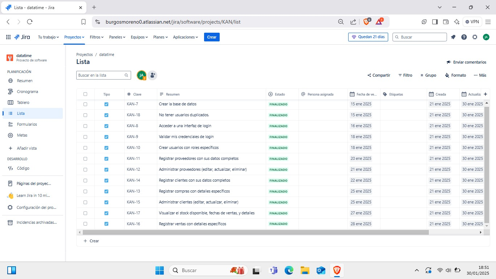

# DOCUMENTACIÓN DE APLICACIÓN MÓVIL METATIME 📱

## 1. Introducción 📜

En este documento se describe el proceso de desarrollo de la aplicación móvil **METATIME** utilizando la metodología **Scrum**, una de las metodologías ágiles más utilizadas en el desarrollo de software. El equipo de trabajo se ha organizado de acuerdo con los roles y eventos de Scrum para asegurar la entrega continua de valor y la mejora continua durante el desarrollo del proyecto.

## 2. Objetivo 🎯

El objetivo de este proyecto es desarrollar una aplicación móvil denominada **METATIME**, que facilite la gestión de inventarios, ventas, compras y control de stock. Utilizando la metodología Scrum, el equipo busca entregar funcionalidades iterativas y de alta calidad mediante el trabajo colaborativo y la mejora continua.

## 3. Backlog e Iteraciones 🔄

### Primer Sprint 🚀

#### Historias de Usuario Realizadas (Sprint Retrospective)

| ID     | Como (rol del usuario)      | Quiero (necesidad o funcionalidad)                          | Para (beneficio esperado)                               | Observaciones del equipo de desarrollo |
|--------|-----------------------------|------------------------------------------------------------|---------------------------------------------------------|----------------------------------------|
| HU-001 | Administrador               | Crear la base de datos                                     | Gestionar eficientemente la información del sistema     | Sin Observaciones                      |
| HU-002 | Usuario/Administrador       | Acceder a una interfaz de login                            | Iniciar sesión de manera segura                         | Sin Observaciones                      |
| HU-003 | Usuario/Administrador       | Validar mis credenciales de login                          | Asegurar el acceso correcto al sistema                   | Sin Observaciones                      |

#### Historias de Usuario Realizadas (Sprint Review)

| ID     | Como (rol del usuario)      | Quiero (necesidad o funcionalidad)                          | Para (beneficio esperado)                               | Observaciones del Product Owner        |
|--------|-----------------------------|------------------------------------------------------------|---------------------------------------------------------|----------------------------------------|
| HU-001 | Administrador               | Crear la base de datos                                     | Gestionar eficientemente la información del sistema     | Aprobado por el Product Owner         |
| HU-002 | Usuario/Administrador       | Acceder a una interfaz de login                            | Iniciar sesión de manera segura                         | Aprobado por el Product Owner         |
| HU-003 | Usuario/Administrador       | Validar mis credenciales de login                          | Asegurar el acceso correcto al sistema                   | Aprobado por el Product Owner         |

### Segundo Sprint 🚀

#### Historias de Usuario Realizadas (Sprint Retrospective)

| ID     | Como (rol del usuario)      | Quiero (necesidad o funcionalidad)                          | Para (beneficio esperado)                               | Observaciones del equipo de desarrollo |
|--------|-----------------------------|------------------------------------------------------------|---------------------------------------------------------|----------------------------------------|
| HU-004 | Administrador               | Crear usuarios con roles específicos                        | Controlar el acceso y las funcionalidades según los roles| Sin Observaciones                      |
| HU-005 | Usuario/Administrador       | Registrar clientes con sus datos completos                  | Mantener un registro detallado de los clientes           | Sin Observaciones                      |
| HU-006 | Usuario/Administrador       | Registrar proveedores con sus datos completos               | Mantener un registro detallado de los proveedores        | Sin Observaciones                      |
| HU-007 | Usuario/Administrador       | Registrar compras con detalles específicos                  | Llevar un control claro de las adquisiciones            | Sin Observaciones                      |

#### Historias de Usuario Realizadas (Sprint Review)

| ID     | Como (rol del usuario)      | Quiero (necesidad o funcionalidad)                          | Para (beneficio esperado)                               | Observaciones del Product Owner        |
|--------|-----------------------------|------------------------------------------------------------|---------------------------------------------------------|----------------------------------------|
| HU-004 | Administrador               | Crear usuarios con roles específicos                        | Controlar el acceso y las funcionalidades según los roles| Aprobado por el Product Owner         |
| HU-005 | Usuario/Administrador       | Registrar clientes con sus datos completos                  | Mantener un registro detallado de los clientes           | Aprobado por el Product Owner         |
| HU-006 | Usuario/Administrador       | Registrar proveedores con sus datos completos               | Mantener un registro detallado de los proveedores        | Aprobado por el Product Owner         |
| HU-007 | Usuario/Administrador       | Registrar compras con detalles específicos                  | Llevar un control claro de las adquisiciones            | Aprobado por el Product Owner         |

### Tercer Sprint 🚀

#### Historias de Usuario Realizadas (Sprint Retrospective)

| ID     | Como (rol del usuario)      | Quiero (necesidad o funcionalidad)                          | Para (beneficio esperado)                               | Observaciones del equipo de desarrollo |
|--------|-----------------------------|------------------------------------------------------------|---------------------------------------------------------|----------------------------------------|
| HU-008 | Usuario/Administrador       | Registrar ventas con detalles específicos                   | Mantener un historial de ventas preciso y actualizado    | Sin Observaciones                      |
| HU-009 | Usuario/Administrador       | Invalidar compras y ventas en caso de errores               | Corregir registros erróneos y asegurar la precisión de la información | Sin Observaciones                      |
| HU-010 | Usuario/Administrador       | Visualización de estado de ventas y stock                   | Analizar el rendimiento de ventas y gestión de inventario | Sin Observaciones                      |

#### Historias de Usuario Realizadas (Sprint Review)

| ID     | Como (rol del usuario)      | Quiero (necesidad o funcionalidad)                          | Para (beneficio esperado)                               | Observaciones del Product Owner        |
|--------|-----------------------------|------------------------------------------------------------|---------------------------------------------------------|----------------------------------------|
| HU-008 | Usuario/Administrador       | Registrar ventas con detalles específicos                   | Mantener un historial de ventas preciso y actualizado    | Aprobado por el Product Owner         |
| HU-009 | Usuario/Administrador       | Invalidar compras y ventas en caso de errores               | Corregir registros erróneos y asegurar la precisión de la información | Aprobado por el Product Owner         |
| HU-010 | Usuario/Administrador       | Visualización de estado de ventas y stock                   | Analizar el rendimiento de ventas y gestión de inventario | Aprobado por el Product Owner         |

## 4. Capturas del Tablero de Tareas 🗂️

  

## 5. Conclusiones y Aprendizajes 📚

A lo largo del desarrollo de la aplicación **METATIME** utilizando la metodología Scrum, se lograron avances significativos en la gestión de inventarios, ventas y compras. Durante cada sprint, el equipo mantuvo un enfoque claro en la entrega de funcionalidades iterativas de alta calidad, lo que permitió un progreso constante hacia el objetivo del proyecto.

Un aprendizaje clave fue la importancia de la colaboración continua entre los miembros del equipo de desarrollo y la estrecha interacción con el Product Owner, lo que garantizó que los requisitos se cumplieran de acuerdo con las expectativas. Además, Scrum facilitó la identificación y resolución eficiente de los desafíos, permitiendo una mejora continua del proceso de desarrollo. De este modo, cada funcionalidad entregada aportó un valor real al usuario final.
